

# Hassan Ahmed

**Full Stack Developer & AI/ML Engineer**

---

## 👨‍💻 Who I Am

| | |
| --- | --- |
| 🧑‍💼 **Name** | Hassan Ahmed |
| 📍 **Location** | Sadiqabad, Pakistan 🇵🇰 |
| 🎓 **Education** | BSCS 2023–2025 · Islamia University of Bahawalpur |
| 💼 **Role** | Full Stack Developer & AI/ML Engineer |
| 📧 **Email** | hani141998@gmail.com |

> *Always learning. Always shipping.* 🚀

---

## 🛠️ Tech Stack

**Languages**

**Frontend**

**Backend & ML/AI**

**Database & Cloud**

---

## 🚀 Featured Projects

### 🐢 TurtleBehaviorML — Sea Turtle Behaviour Classification
> Multi-model behaviour classification from bio-logger gyroscope data · 5.5M-row real sensor dataset · Grouped train/test split by individual

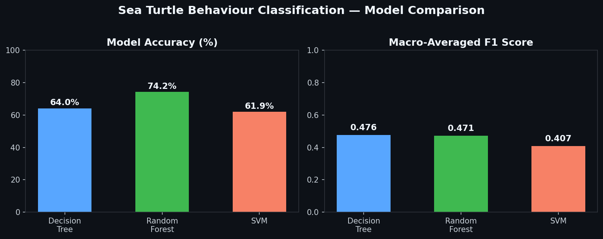

| Feature | Details |
| --- | --- |
| 🤖 **3-Model Comparison** | Decision Tree · Random Forest (**74.2% acc**) · SVM |
| 📡 **Real Bio-Logger Data** | 5.5M raw gyroscope rows → 54,906 feature windows (20Hz) |
| 🐢 **Turtle-Grouped Split** | Train/test split by individual — avoids data leakage |
| 📊 **46 Statistical Features** | Mean, SD, IQR, energy, skewness, kurtosis per window |
| 📈 **Full Metric Suite** | Confusion matrix · sensitivity · specificity · macro F1 |

---

### 🏥 InsureCalc — Medical Insurance Cost Predictor
> AI-powered insurance cost prediction · 4 ML models · Confidence intervals · Savings estimator

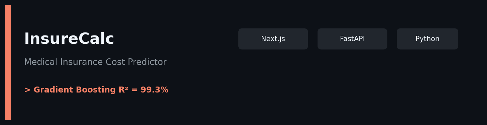

| Feature | Details |
| --- | --- |
| 🤖 **4 ML Models** | Linear · Ridge · Lasso · **Gradient Boosting (R²=99.3%)** |
| 📊 **Animated Charts** | Donut breakdown · Age group comparison slider |
| 💰 **Savings Estimator** | Quit smoking / BMI goals → 1yr / 5yr / 10yr projections |
| 🗺️ **Regional Map** | SVG US map with avg costs by region |
| 🔗 **Shareable Quotes** | UUID per prediction · Neon PostgreSQL history |

---

### 🫀 CardioScan — Heart Attack Risk Prediction
> XGBoost + Random Forest + KNN ensemble · ROC-AUC ~94% · Animated ECG hero

| Feature | Details |
| --- | --- |
| 🤖 **Ensemble ML** | XGBoost + RF + KNN · **ROC-AUC ~94%** |
| 💓 **Live ECG Canvas** | Animated electrocardiogram in hero section |
| 🎯 **Risk Zones** | 0–100 score → 🟢 Low / 🟡 Moderate / 🟠 High / 🔴 Critical |
| 🔬 **What-If Simulator** | Adjust clinical values → see risk delta live |
| 📈 **Analytics** | ROC curves · Feature importance · Radar chart |

---

### 🛡️ GlucoseGuard — Diabetes Risk Classification
> Random Forest + Logistic Regression + SVM · SHAP explainability · PDF reports

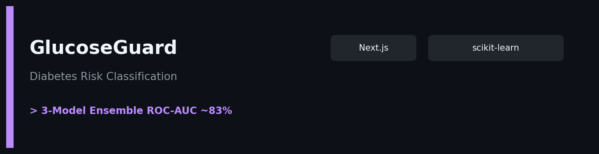

| Feature | Details |
| --- | --- |
| 🤖 **3-Model Ensemble** | RF · LR · SVM · **ROC-AUC ~83%** · Pima Indians Dataset |
| 🧠 **SHAP Values** | Approximate SHAP · directional feature importance chart |
| 🔬 **What-If Simulator** | Live dual-gauge risk update on slider changes |
| 📄 **PDF Reports** | Downloadable per-prediction clinical report |
| 🧬 **Neural Background** | Animated canvas neural network in hero |

---

### 💱 ForexPulse — USD/TRY Exchange Rate Forecaster
> Time series forecasting for currency exchange rates

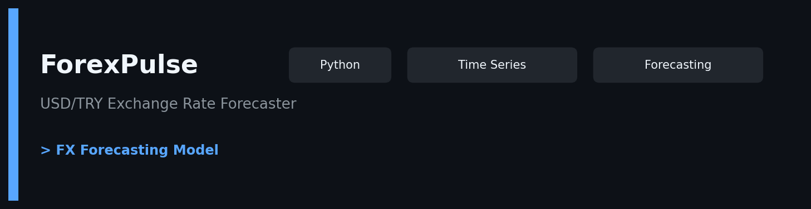

---

### 🚚 FleetFlow — AI-Powered Logistics Dashboard
> Fleet analytics and logistics intelligence dashboard

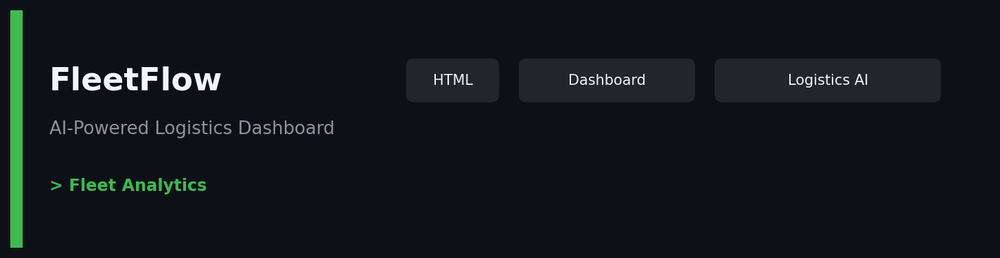

---

### ⚖️ Saudi Legal RAG Platform — Starter Scaffold
> Retrieval-Augmented Generation scaffold for legal document Q&A

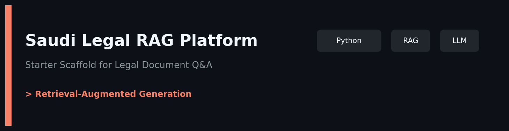

---

### 📘 LedgerClass — Student Management System
> Full student records, billing, and school management

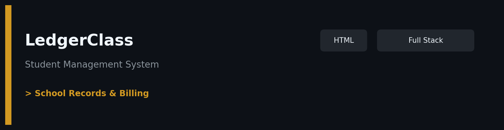

---

### ✈️ SkyRate — Airline Passenger Satisfaction Classifier
> ML classification for predicting airline passenger satisfaction

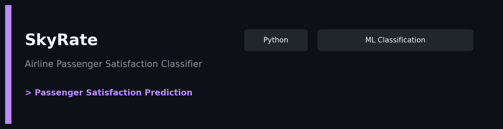

---

### 🔬 ClusterLab — Interactive Clustering Explorer
> Explore K-Means and hierarchical clustering interactively

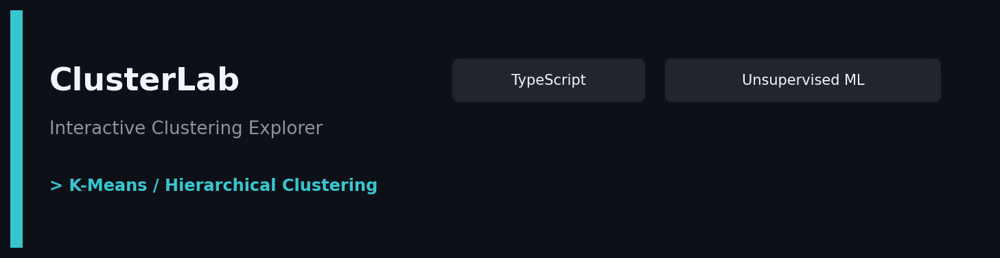

---

### 🇫🇷 Dossier Français — French Learning App for TCF/TEF Canada
> Language exam preparation platform for Canadian immigration French tests

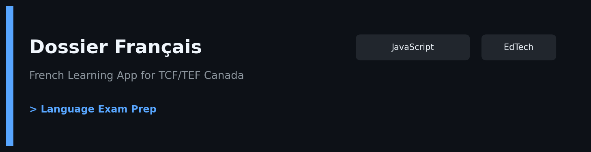

---

### 🏡 MelbProp — Melbourne House Price Predictor
> Regression model for real estate price prediction

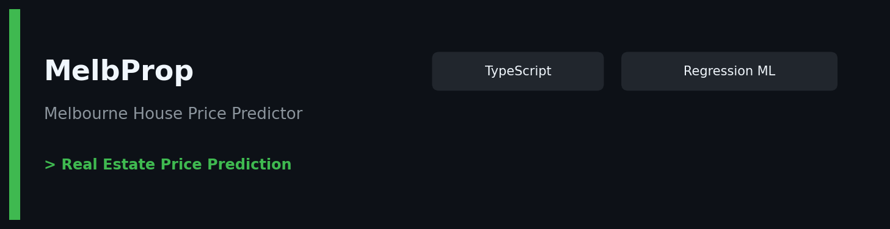

---

### 🎯 SegmentIQ — Customer Segmentation Intelligence Platform
> Customer segmentation using clustering and business intelligence

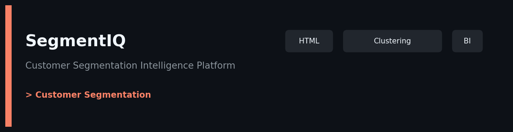

---

### 🧾 BillingPro — FastAPI + Next.js Multi-Department POS
> Full point-of-sale system across multiple departments

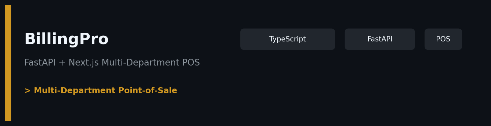

---

### 📈 SalesIQ — Business Intelligence Dashboard
> Sales analytics, forecasting, and business intelligence

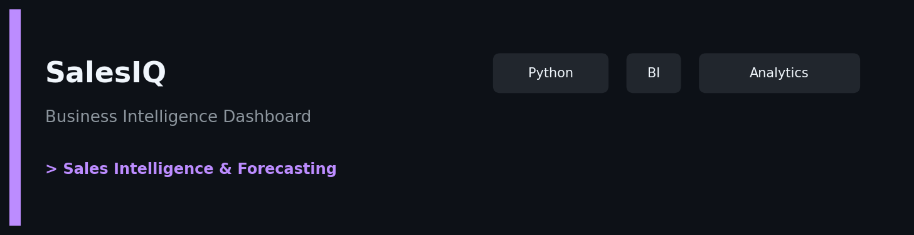

---

### 🏫 MTB School & College Management System
> School and college management with attendance system

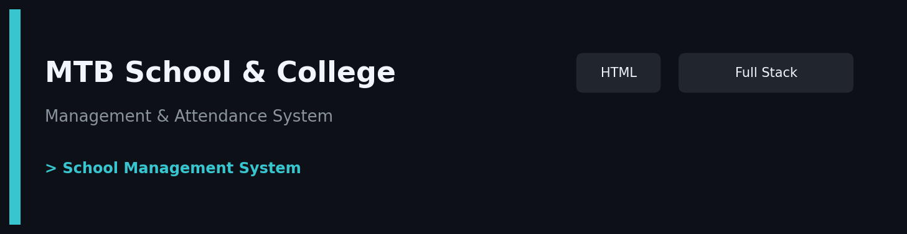

---

### 🎵 Chinook Analytics — Music Store Business Intelligence
> End-to-end SQL analytics dashboard · 7 views · RFM segmentation · Revenue forecasting

| Feature | Details |
| --- | --- |
| 📊 **Business Overview** | $865.64 revenue · 154 orders · 22 customers tracked |
| 🎤 **Artists & Albums** | Top performers · genre breakdown |
| 🌍 **Markets** | Revenue by country · Top 8 geographic breakdown |
| 🎯 **RFM Segments** | Recency · Frequency · Monetary customer scoring |
| 🔮 **Revenue Trends** | Monthly trend charts · forecasting |

---

### ⚡ IoT Smart Energy Management System (SEMS)
> ARIMA forecasting · MQTT TLS 1.3 · AWS IoT · LoRaWAN · Final Year Project 2025

| Feature | Details |
| --- | --- |
| 📡 **Real-time** | ESP32 + MQTT TLS 1.3 · WebSocket live updates |
| 🔮 **7-Day Forecast** | ARIMA model · **MAPE 7.4%** |
| 🚨 **Anomaly Detection** | Z-Score ±3σ · FCM + SMTP alerts |
| ☀️ **Solar Integration** | Modbus-TCP PV · savings tracking |
| 🌾 **Rural Ready** | LoRaWAN SX1276 for off-grid deployment |

---

### 📝 ExamPrep — AI-Powered Exam Preparation
> AI study assistant for exam preparation

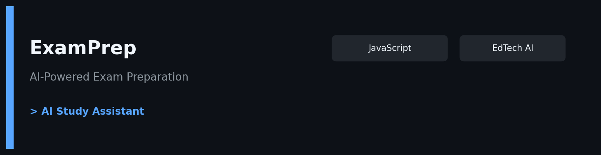

---

### 🎬 StreamVault — Media Streaming Platform
> Full-stack media streaming web application

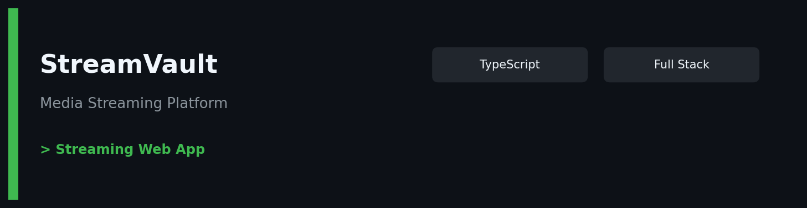

---

### 🎯 Face Recognition Attendance System
> Real-time AI face detection · Flask · PostgreSQL · CSV export

Real-time face detection & recognition via **Face-API.js** · Student profiles · Analytics dashboard · CSV export · PostgreSQL persistence

---

### 🧠 AI Resume Analyzer
> Smart resume analysis · ATS scoring · NLP-powered feedback

---

## 📊 GitHub Stats

---

## 🏆 Quick Reference

| Project | Domain | Best Metric | Live |
| --- | --- | --- | --- |
| 🐢 **TurtleBehaviorML** | Bio-Logging · Animal Behaviour | RF acc = 74.2% | [⌥](https://github.com/Hassan141998/TurtleBehaviorML) |
| 🏥 **InsureCalc** | Fintech · Insurance | R² = 99.3% | [▶](https://insurecalc-app.vercel.app) |
| 🫀 **CardioScan** | Healthcare · Cardiology | AUC ≈ 94% | [▶](https://cardio-heart.vercel.app) |
| 🛡️ **GlucoseGuard** | Healthcare · Diabetes | AUC ≈ 83% | [▶](https://glucose-guard.vercel.app) |
| 💱 **ForexPulse** | Finance · Forecasting | Time series FX | [⌥](https://github.com/Hassan141998/ForexPulse-USD-TRY-Exchange-Rate-Forecaster) |
| 🚚 **FleetFlow** | Logistics · AI | Fleet analytics | [⌥](https://github.com/Hassan141998/FleetFlow-AI-Powered-Logistics-Dashboard) |
| ⚖️ **Saudi Legal RAG** | LegalTech · LLM | RAG scaffold | [⌥](https://github.com/Hassan141998/Saudi-Legal-RAG-Platform-Starter-Scaffold) |
| 📘 **LedgerClass** | EdTech · Management | Student records | [▶](https://ledger-class-student-management-sys.vercel.app) |
| ✈️ **SkyRate** | Aviation · ML | Satisfaction classifier | [⌥](https://github.com/Hassan141998/SkyRate-Airline-Passenger-Satisfaction-Classifier) |
| 🔬 **ClusterLab** | ML · Unsupervised | Clustering explorer | [⌥](https://github.com/Hassan141998/ClusterLab-Interactive-Clustering-Explorer) |
| 🇫🇷 **Dossier Français** | EdTech · Language | Exam prep | [▶](https://dossier-fran-ais-french-learning-ap-two.vercel.app) |
| 🏡 **MelbProp** | Real Estate · ML | Price prediction | [▶](https://melbprop.vercel.app) |
| 🎯 **SegmentIQ** | BI · Clustering | Customer segments | [▶](https://segment-iq-customer-segmentation-in.vercel.app) |
| 🧾 **BillingPro** | Retail · POS | Multi-dept POS | [▶](https://billing-pro-seven.vercel.app) |
| 📈 **SalesIQ** | BI · Analytics | Sales intelligence | [▶](https://sales-iq-business-intelligence.vercel.app) |
| 🏫 **MTB School** | EdTech · Management | School system | [▶](https://mtb-school-college-management-syste.vercel.app) |
| 🎵 **Chinook Analytics** | Data Analytics · SQL | 7 dashboard views | [▶](https://hassan-chinook.streamlit.app/) |
| ⚡ **SEMS IoT** | IoT · Energy | ARIMA MAPE 7.4% | [▶](https://io-t-based-smart-energy-management.vercel.app) |
| 📝 **ExamPrep** | EdTech · AI | Study assistant | [▶](https://exam-prep-blond.vercel.app) |
| 🎬 **StreamVault** | Media · Full Stack | Streaming platform | [▶](https://streamvault-one.vercel.app) |
| 🎯 **Face Attendance** | Computer Vision | Real-time AI | [▶](https://student-attendance-face-recognition.vercel.app) |
| 🧠 **AI Resume** | NLP · HR Tech | ATS scoring | [▶](https://ai-resume-analyzer-5p4l-mfmxlvq2t.vercel.app/) |

---

## 🌐 Connect With Me

